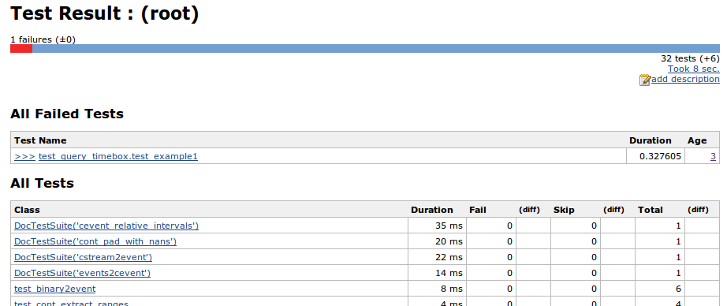
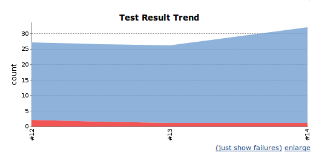

# matlab-xunit

xUnit for Matlab with JUnit-compatible XML output

# README

Testing is wonderful! Let's make it easier and more rewarding!

The most popular testing platform for MATLAB functions and classes is/was Steve Eddins' excellent [Matlab xUnit](http://www.mathworks.com/matlabcentral/fileexchange/22846-matlab-xunit-test-framework) package.

The previous maintainer, [Thomas Smith](https://github.com/tgs/), made two additions to that package: the ability to give output in a JUnit-compatible XML format, and the ability to run DocTests, similar to the ``doctest`` module in Python or vignettes in R.

I've made one additional change: renaming ``runtests`` to ``runxunit`` so that it's compatible with MATLAB R2013a and newer. (``runtests`` is now a built-in function.)

# XML Output

Why would you want to do that?  Well, because other tools understand it. In particular, I'm using the Jenkins continuous integration system (http://jenkins-ci.org/) to automatically run unit tests when I check in code. Jenkins understands JUnit's XML report format, and can display it in very nice ways. By creating a test report file in the same format, we can leverage all of that.

For example, here's a screenshot of the table Jenkins generates from a single build's report:

And here's a graph of the test trend:

## Usage

To use this feature, clone or download this from GitHub, and put the ``xunit-matlab/xunit`` directory on your MATLAB path (using ``addpath``).

Once you've written some unit tests (see [xUnit's help](https://cdn.rawgit.com/psexton/matlab-xunit/master/doc/xunit_product_page.html)), you can then run:

    runxunit path/to/test/dir -xmlfile testreport.xml

Unsurprisingly, this will run your unit tests and put the results into ``testreport.xml`` in the current directory.

## Usage with Jenkins

OK, this is really cool, but involves some setup. First, you're going to have to either install Jenkins on the machine that has Matlab, or give Jenkins remote access to that machine (there may be Matlab licensing issues to this, I have no idea). As a note, installing Jenkins is incredibly easy: you download one file and run one command.

Now, you need to create a job that checks out your code from Subversion or whatever, and then runs your tests. I'm not going to run you through the whole thing, but here are the two important points:

First, you need a build step that will run the tests. Mine looks something like this:

    /path/to/matlab -nodisplay -r "try; \
        addpath /path/to/xunit-matlab-doctest/xunit; \
        runxunit -xmlfile testreport.xml the_tests/; \
      catch Ex; fprintf(2, Ex.getReport()); quit(1); end; \
      quit(0);"
  
And second, you need to check the Jenkins box that says "Publish JUnit test result report." I tell it to look at ``**/testreport.xml``.

Now save the configuration, tell the project to Build Now, and you should have a lovely display of what tests were run, and which failed!
